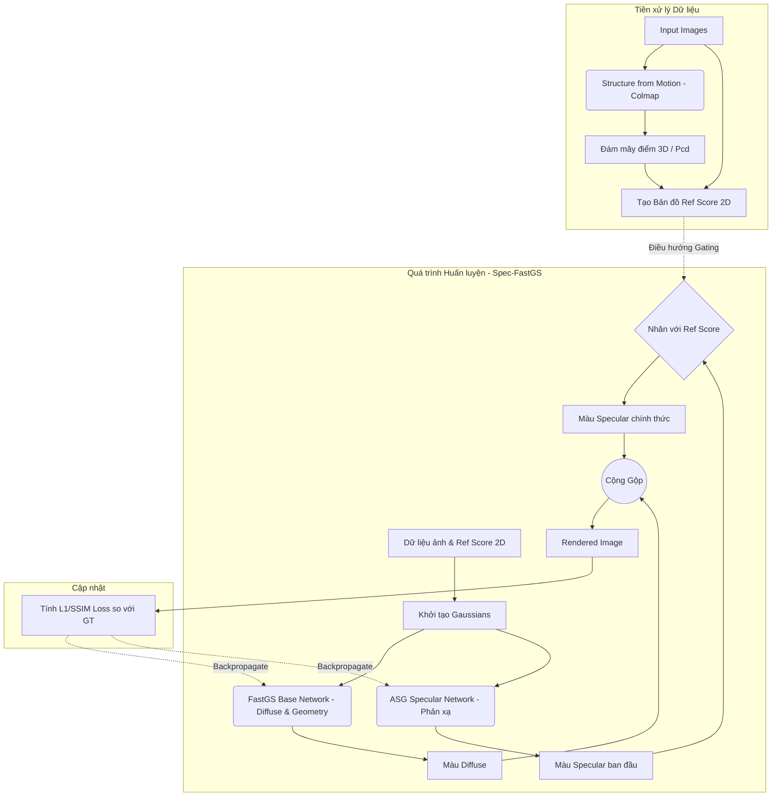

# Báo cáo Chi tiết: Cơ chế Reflection Score (Ref Score)

Tài liệu này trình bày toàn diện về nguyên lý, thuật toán, kiến trúc và những ưu/nhược điểm của cơ chế **Ref Score** đang được triển khai trên nhánh `spec-fastgs-unofficial`.

---

## 1. Nguyên lý và cách tạo nên Ref Score

**Nguyên lý cốt lõi**: Phân biệt tính chất vật lý của bề mặt dựa vào **Tính nhất quán đa góc nhìn (Multi-view Consistency)**.
- **Bề mặt nhám (Diffuse)**: Dù bạn nhìn từ bất kỳ góc độ nào, màu sắc của điểm đó hầu như không thay đổi (tính đẳng hướng - Lambertian).
- **Bề mặt bóng (Specular / Reflection)**: Khi thay đổi góc nhìn, ánh sáng phản xạ tới mắt người quan sát sẽ thay đổi liên tục. Điểm ảnh sẽ chớp tắt hoặc biến đổi màu sắc mạnh mẽ.

**Cách tạo nên Ref Score**:
1. Lấy dữ liệu đám mây điểm 3D (Point Cloud) từ hệ thống camera.
2. Với mỗi điểm 3D, chiếu nó lên tất cả các bức ảnh 2D xem nó xuất hiện ở những camera nào.
3. Thu thập danh sách màu sắc của điểm đó trên các bức ảnh 2D tương ứng.
4. Tính toán độ lệch/phương sai (Variance) của các màu sắc đó. Phương sai càng lớn $\rightarrow$ Điểm đó càng có tính phản xạ (bóng).
5. Chuẩn hóa điểm số này về thang $[0, 1]$ và lưu lại thành bản đồ 2D cho từng góc camera.

---

## 2. Phương pháp đánh giá Ref Score (Tốt hay Xấu?)

Để đánh giá một Ref Score đang hoạt động hiệu quả hay không, chúng ta kết hợp 2 phương pháp:

### A. Đánh giá Định tính (Đảo mắt bằng trực giác)
Xuất các ma trận 2D Ref Score thành các bức ảnh đen trắng (Grayscale) và quan sát bằng mắt thường:
- **TỐT**: Vùng màu trắng rực (Ref=1) nằm chính xác tại các đốm sáng lấp lánh (highlights) trên vật thể. Vùng màu đen kịt (Ref=0) bao phủ toàn bộ phông nền và các vật liệu nhám (gỗ, nhựa đục).
- **XẤU**: 
  - *Lỗi Edge Bleeding*: Viền của vật thể bị sáng rực lên do sai số chiếu 3D-2D.
  - *Lỗi Black Metal*: Bề mặt kim loại bóng loáng nhưng lại có Ref Score = 0 do thuật toán đánh giá sai phương sai.
  - *Lỗi Occlusion (Z-conflict)*: Những vùng bị che khuất (nhìn xuyên thấu) lại bị gán điểm phản xạ cao.

### B. Đánh giá Định lượng (Chỉ số Metrics)
- Đưa Ref Score vào quá trình huấn luyện mạng Spec-FastGS.
- Nếu **PSNR / SSIM tăng lên**: Ref Score đang làm tốt vai trò "người dẫn đường", giúp mạng phân tách (disentangle) thành công màu nhám và màu bóng.
- Nếu **PSNR / SSIM giảm hoặc model bị cháy sáng**: Ref Score đang cung cấp tín hiệu nhiễu, khiến mạng bị ép học sai hướng (ví dụ: ép vùng có đốm sáng phải dùng mạng Diffuse để học).

---

## 3. Thuật toán tạo Ref Score (Kèm Công thức Toán)

Thuật toán này được chạy tiền xử lý (offline) thông qua script `extract_reflection_prior.py`.

### A. Thuật toán giả mã (Pseudo-code)

```python
# 1. Tính toán điểm phản xạ 3D (Ref Score 3D)
Đối với mỗi điểm P_i trong Đám mây điểm 3D:
    Màu_sắc_thu_thập = []
    Đối với mỗi Camera C_j:
        Nếu P_i nằm trong tầm nhìn của C_j và không bị che khuất:
            Lấy màu RGB của pixel chiếu tương ứng trên C_j
            Thêm vào mảng Màu_sắc_thu_thập
    
    Nếu độ dài(Màu_sắc_thu_thập) > 1:
        # Tính khoảng cách màu lớn nhất
        Score_3D[i] = MAX_DIFFERENCE(Màu_sắc_thu_thập)
    Ngược lại:
        Score_3D[i] = 0

# Chuẩn hóa về [0, 1]
Score_3D = Chuẩn_hóa_Min_Max(Score_3D)

# 2. Chiếu về 2D (Tạo Ref Map)
Đối với mỗi Camera C_j:
    Khởi tạo Ref_Map_2D toàn số 0
    Khởi tạo Z_Buffer toàn vô cực
    Đối với mỗi điểm P_i:
        Chiếu P_i lên ảnh tạo thành tọa độ (x, y) và chiều sâu z
        Nếu z < Z_Buffer[x, y]:  # Cơ chế che khuất (Occlusion culling)
            Ref_Map_2D[x, y] = Score_3D[i]
            Z_Buffer[x, y] = z
```

### B. Công thức Toán học

1. **Phương sai ánh sáng (Luminance Variance)**: Thay vì dùng phương sai chuẩn, hệ thống tính chênh lệch độ sáng (Luminance L) lớn nhất để chống nhiễu:
   $$ \Delta L_i = \max_{j, k \in V_i} | L(C_{j}) - L(C_{k}) | $$
   Trong đó $V_i$ là tập các camera nhìn thấy điểm $i$, và $L(C)$ là độ sáng của pixel.

2. **Chuẩn hóa Min-Max**:
   $$ Ref_{3D}(i) = \frac{\Delta L_i - \min(\Delta L)}{\max(\Delta L) - \min(\Delta L)} $$

3. **Cơ chế Z-Buffering (Loại bỏ điểm bị che)**:
   $$ Ref_{2D}(x, y) = Ref_{3D} \left( \arg\min_{i: proj(P_i) = (x,y)} Z_i \right) $$

---

## 4. Framework & Vị trí của Ref Score trong Hệ thống

Sơ đồ quy trình (Pipeline) của hệ thống Spec-FastGS kết hợp Ref Score:



**Nhận xét Vị trí**: Việc tạo Ref Score là một quy trình Độc lập và Offline, diễn ra **trước khi** mạng Neural bắt đầu train. Bản đồ Ref Score đóng vai trò như một bộ lọc (Filter/Gate) điều tiết dòng chảy thông tin ở khúc cuối của mạng Specular.

---

## 5. Điểm mạnh, Điểm yếu và Hạn chế hiện tại

### Điểm mạnh (Ưu điểm)
- **Tách biệt rõ ràng (Explicit Disentanglement)**: Cung cấp tín hiệu vật lý trực tiếp cho mạng Neural thay vì bắt nó tự mò mẫm, giúp ép mạng Base chỉ tập trung học hình dáng và mạng ASG chỉ tập trung học ánh sáng.
- **Tiết kiệm tham số**: Chặn mạng ASG (ốn nhiều tính toán) hoạt động ở những khu vực không cần thiết (Ref=0).

### Điểm yếu (Nhược điểm)
- **Quá trình trích xuất rất chậm (Overhead)**: Phải chạy vòng lặp lặp đi lặp lại trên hàng triệu điểm ảnh và so sánh độ sâu, làm tăng đáng kể tổng thời gian huấn luyện.
- **Phụ thuộc quá nhiều vào Point Cloud**: Nếu Colmap tạo ra đám mây điểm tồi, Ref Score sẽ sai bét.

### Hạn chế trong Deploy hiện tại (Bugs)
- **Occlusion/Z-Conflict Bug**: Việc dùng Min-Z để chiếu điểm 3D về 2D rất thô sơ, dẫn đến những điểm nằm lơ lửng phía sau vật thể vô tình bị lọt lên trước và tạo ra các đốm nhiễu phản xạ.
- **Edge Bleeding Bug**: Cạnh của các vật thể dễ bị lem viền do sai số độ phân giải khi làm Z-Buffering.
- **Hạn chế Gradient**: Việc nhân cứng mạng ASG với Ref=0 làm triệt tiêu hoàn toàn đạo hàm truyền ngược (Zero Gradient), khiến mạng ASG không thể học được gì ở những khu vực lân cận, gây ra rủi ro mắc kẹt cục bộ (Local Minima).

---

## 6. Vai trò của Ref Score trong Cơ chế RSA

**RSA (Reflection-aware Spatial Adaptation - Thích ứng không gian dựa trên phản xạ)** là khái niệm cốt lõi mà nhánh này đang theo đuổi.

Trong phương trình màu sắc cuối cùng của quá trình Render:
$$ C_{final} = C_{diffuse} + C_{specular} $$

Cơ chế RSA can thiệp trực tiếp bằng cách chèn Ref Score vào:
$$ C_{final} = C_{diffuse} + \mathbf{Ref\_Score(x,y)} \times C_{specular} $$

**Vai trò cụ thể của Ref Score trong RSA**:
1. **Van xả (Gating Valve)**: Hoạt động như một cánh cổng Neural (Neural Gating). Khi $Ref = 0$, cánh cổng đóng lại, mạng Specular bị "tắt điện". Khi $Ref = 1$, cánh cổng mở tối đa.
2. **Ép buộc phân tách (Forced Disentanglement)**: Nó gửi thông điệp cứng rắn đến bộ tối ưu (Optimizer) rằng: *"Ở những vùng nhám, mài đừng cố dùng mạng Specular để sửa lỗi, hãy dùng mạng Diffuse!"*
3. **Tiết kiệm dung lượng bộ nhớ (Sparsity)**: Bằng cách ép phần lớn $C_{specular}$ về 0, mạng ASG trở nên thưa thớt (sparse) hơn, tiềm năng giúp giảm gánh nặng tính toán lúc Render và dung lượng lưu trữ (Dù hiện tại bản code của ta vẫn tính toán $C_{specular}$ toàn cục trước khi đem nhân với Ref, nhưng ý tưởng lý thuyết là vậy).
