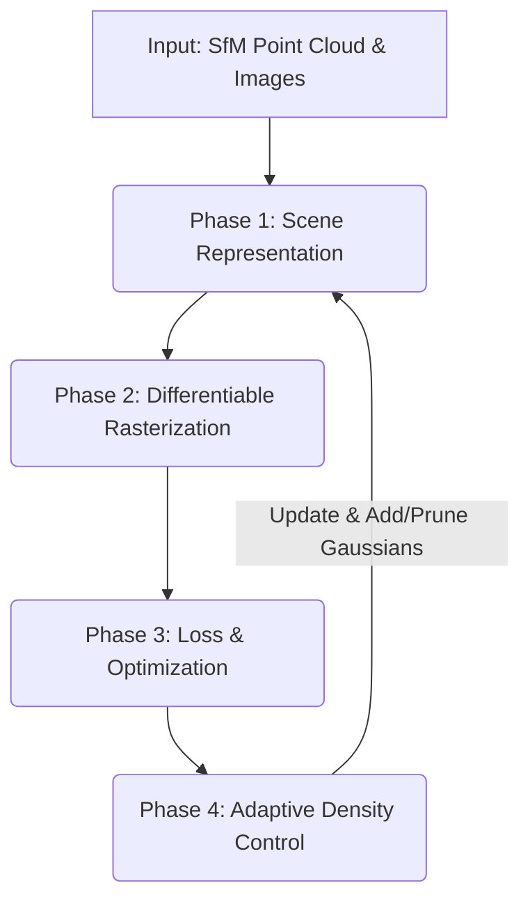
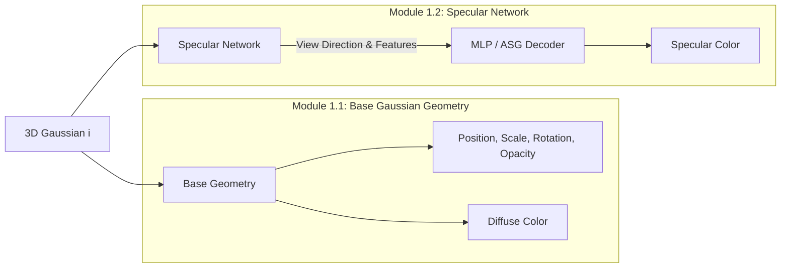
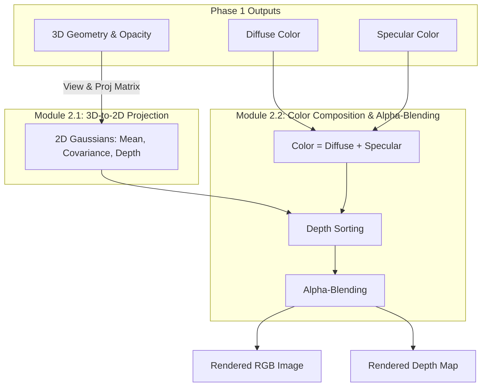
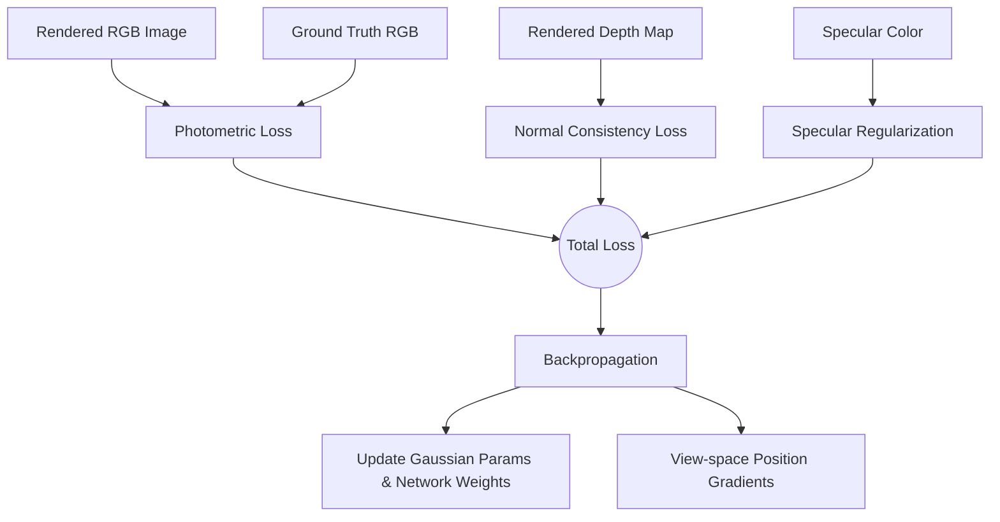
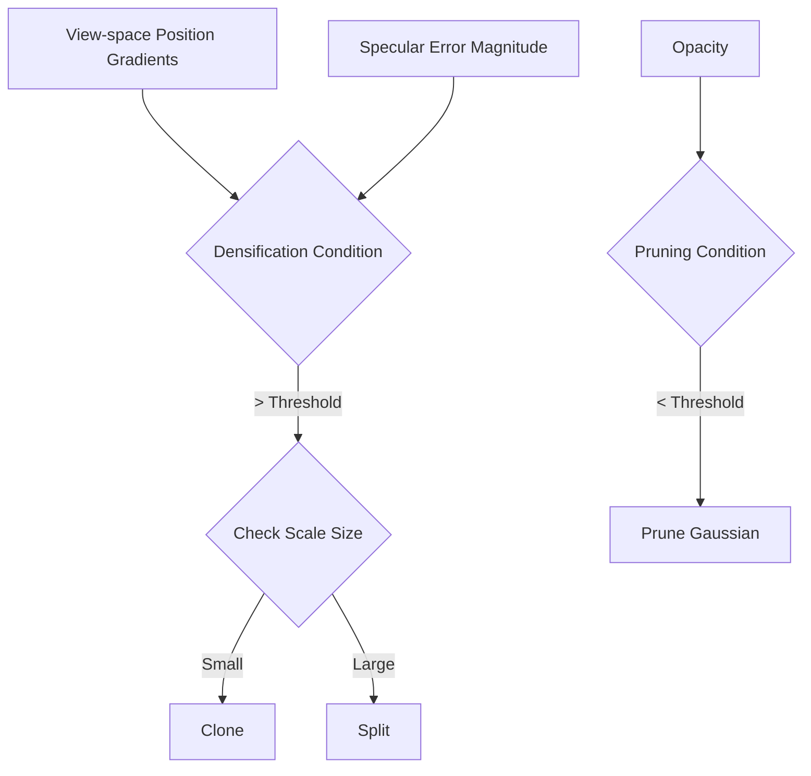

# Phân tích Kiến trúc spec-fastgs: Luồng Dữ liệu (Input/Output) theo từng Phase

Tài liệu này trình bày chi tiết luồng xử lý dữ liệu (data flow), đầu vào (Input) và đầu ra (Output) của hệ thống `spec-fastgs` (dựa trên bộ khung 3DGS/FastGS kết hợp SpecularNetwork và các cải tiến từ Hướng A). Cấu trúc này được thiết kế theo chuẩn văn phong học thuật, rất thuận tiện để bạn đưa thẳng vào báo cáo hoặc luận văn.

### Sơ đồ Tổng thể Hệ thống (Overall Framework)

---

## 0. Giai đoạn Tiền xử lý (Data Preprocessing / Initialization)
Đây là giai đoạn khởi tạo trạng thái ban đầu của hệ thống trước khi bước vào vòng lặp huấn luyện.

*   **Input:**
    *   Tập ảnh đa góc nhìn (Multi-view Images): $I = \{I_1, I_2, ..., I_M\}$
    *   Thông số Camera (Extrinsics & Intrinsics) từ thuật toán Structure-from-Motion (SfM) như COLMAP: Tập hợp ma trận góc nhìn $V_m$ và ma trận chiếu $P_m$.
    *   Đám mây điểm thưa (Sparse Point Cloud): Tập hợp các điểm 3D $P = \{p_1, p_2, ..., p_N\}$ trích xuất từ SfM.
*   **Xử lý (Processing):** Để chuyển đổi đám mây điểm thưa (chỉ có tọa độ và màu sắc) thành các hạt Gaussian 3D có thể tích và hướng, hệ thống thực hiện khởi tạo (Initialization) như sau:
    *   *Vị trí (Position/Mean $\mu_i$):* Lấy trực tiếp từ tọa độ 3D ($xyz$) của điểm SfM $p_i$.
    *   *Màu sắc (Color/SH):* Lấy từ màu RGB của điểm SfM. Hệ số Spherical Harmonics (SH) bậc 0 được khởi tạo tương đương với màu RGB này, các bậc SH cao hơn khởi tạo bằng 0.
    *   *Kích thước (Scale $s_i$):* Ban đầu được giả định là hình cầu hoàn hảo (isotropic, $s_x=s_y=s_z$). Kích thước khởi tạo thường được tính dựa trên **khoảng cách trung bình tới $k$ điểm lân cận gần nhất** (thường $k=3$) để đảm bảo các hạt Gaussian tỏa ra đủ lớn, che phủ kín bề mặt mà không để lại lỗ hổng.
    *   *Góc xoay (Rotation $q_i$):* Khởi tạo bằng Quaternion đơn vị $q = [1, 0, 0, 0]$ (tức là chưa có góc xoay).
    *   *Độ đục (Opacity $\alpha_i$):* Khởi tạo bằng một hằng số nhỏ (ví dụ $\alpha = 0.1$), mang tính chất bán trong suốt để quá trình Gradient Descent dễ dàng đi xuyên qua và điều chỉnh độ đục tăng giảm về sau.
*   **Output:** 
    *   Tập hợp các Gaussian 3D khởi tạo $G = \{g_1, g_2, ..., g_N\}$. Mỗi hạt Gaussian $g_i$ mang đầy đủ 5 thuộc tính cơ bản: Vị trí ($\mu_i$), Màu sắc ($c_i$ hoặc $SH_i$), Kích thước ($s_i$), Góc xoay ($q_i$), và Độ đục ($\alpha_i$), sẵn sàng làm đầu vào cho Phase 1.

---

## 1. Phase 1: Biểu diễn Cảnh (Scene Representation)
Giai đoạn này định nghĩa các tham số học được (learnable parameters) đại diện cho hình học và tính chất quang học của cảnh. `spec-fastgs` chia sự biểu diễn này thành hai module song song.

### Module 1.1: Base Gaussian Geometry (Hình học và Màu cơ bản)
*   **Input:** Tập hợp Gaussian $G$ hiện tại.
*   **Xử lý:** Lưu trữ, tổ chức các cấu trúc dữ liệu Tensor chứa các thuộc tính vật lý của hạt Gaussian và thực hiện các bước chuẩn bị tham số cho quá trình kết xuất:
    *   *Khai báo biến tối ưu (Optimizable variables):* Định nghĩa các tham số bao gồm vị trí trung tâm $\mu_i$, hệ số tỷ lệ log-scale $s_{log} = \ln(s_i)$ (để đảm bảo scale luôn dương), quaternion góc xoay $q_i$ được chuẩn hóa về độ dài bằng 1, giá trị logit của độ đục $\alpha_{logit}$ sao cho $\alpha_i = \sigma(\alpha_{logit})$ (với $\sigma$ là hàm sigmoid để ép độ đục nằm trong khoảng $[0, 1]$), và hệ số màu khuếch tán cơ bản.
    *   *Tính toán ma trận hiệp phương sai 3D ($\Sigma_i$):* Biểu diễn không gian của Gaussian 3D được xác định bởi ma trận hiệp phương sai $\Sigma_i = R S S^T R^T$, trong đó $S = \text{diag}(s_i)$ là ma trận tỷ lệ và $R$ là ma trận xoay 3D được xây dựng từ Quaternion $q_i$.
*   **Output:** Đối với mỗi Gaussian $i$, xuất ra các Vector tham số (tương tự 3DGS gốc):
    *   Vị trí trung tâm (Center/Mean): $\mu_i \in \mathbb{R}^3$
    *   Độ giãn theo 3 trục (Scale): $s_i \in \mathbb{R}^3$
    *   Góc xoay (Rotation Quaternion): $q_i \in \mathbb{R}^4$
    *   Độ đục (Opacity): $\alpha_i \in [0, 1]$
    *   Màu khuếch tán cơ bản (Diffuse Color / Base SH): $c_{diff, i} \in \mathbb{R}^3$

### Module 1.2: Specular Network (Mạng dự đoán Phản xạ)
*   **Input:** 
    *   Vị trí Gaussian $\mu_i \in \mathbb{R}^3$.
    *   Hướng nhìn (View Direction) $v_i \in \mathbb{R}^3$ (tính từ tâm Camera đến $\mu_i$).
    *   Đặc trưng phản xạ ẩn (Latent Specular Features) $f_{spec, i}$ của Gaussian đó.
*   **Xử lý:** Tính toán màu sắc phản xạ góc nhìn dựa trên các đặc trưng quang học và mô hình giải mã:
    *   *Xác định vector hướng nhìn ($v_i$):* Tính toán vector chuẩn hóa từ tâm camera $c$ đến vị trí Gaussian $\mu_i$: $v_i = \frac{\mu_i - c}{\|\mu_i - c\|_2}$.
    *   *Nhúng đặc trưng (Feature Encoding):* Đặc trưng phản xạ $f_{spec, i}$ đại diện cho tính chất bề mặt được kết hợp với vector hướng nhìn $v_i$ thông qua phép nhân tensor (tensor product) hoặc phép nối trực tiếp.
    *   *Mô hình hóa hàm phân phối ASG hoặc giải mã MLP:* Đặc trưng tích hợp được đưa qua mạng Specular MLP hoặc ánh xạ thông qua hàm ASG (Anisotropic Spherical Gaussian) có dạng: $\Phi(v_i) = \sum_{k} A_k \cdot e^{-\lambda_k (v_i \cdot x_k)^2 - \mu_k (v_i \cdot y_k)^2}$ (với $x_k, y_k$ là trục tiếp tuyến và pháp tuyến bề mặt) để tính toán thành phần màu sắc phản xạ.
*   **Output:** Màu phản xạ (Specular Color): $c_{spec, i} \in \mathbb{R}^3$ phụ thuộc vào góc nhìn $v_i$.

---

## 2. Phase 2: Kết xuất Đồ họa Vi phân (Differentiable Rasterization / Forward Pass)
Giai đoạn này chuyển đổi không gian 3D thành bức ảnh 2D thông qua phương pháp "Splatting". Đây là bước tiêu tốn nhiều tài nguyên nhất (FPS bottleneck).

### Module 2.1: Chiếu 3D xuống 2D (3D-to-2D Projection)
*   **Input:** 
    *   Hình học 3D của Gaussian ($\mu_i, s_i, q_i$).
    *   Ma trận Camera của góc nhìn hiện tại (View Matrix $W$, Projection Matrix $K$).
*   **Xử lý:** Thực hiện phép chiếu phối cảnh (Perspective Projection) tuyến tính hóa từ không gian thế giới (World space) sang không gian Camera và không gian chuẩn hóa ảnh (Normalized Device Coordinates - NDC):
    *   *Chiếu vị trí trung tâm:* Tọa độ 3D $\mu_i$ được nhân với ma trận View-Projection để tìm vị trí pixel 2D tương ứng $\mu'_i$.
    *   *Tuyến tính hóa ma trận hiệp phương sai (EWA Splatting):* Ma trận hiệp phương sai 2D $\Sigma'_i$ được tính bằng phép xấp xỉ tuyến tính hóa bậc nhất (Jacobian) theo công thức: $\Sigma'_i = J W \Sigma_i W^T J^T$, trong đó $W$ là ma trận View của Camera, và $J$ là ma trận Jacobian của phép chiếu phối cảnh tại vị trí $\mu_i$ trong không gian camera.
    *   *Tính toán độ sâu phối cảnh:* Tính toán khoảng cách tọa độ $z$ của $\mu_i$ trong hệ tọa độ Camera để xác định thứ tự ưu tiên hiển thị.
*   **Output:** 
    *   Vị trí trung tâm 2D (Screen-space Mean): $\mu'_{i} \in \mathbb{R}^2$
    *   Ma trận hiệp phương sai 2D (2D Covariance Matrix): $\Sigma'_{i} \in \mathbb{R}^{2\times 2}$
    *   Chiều sâu của Gaussian (Depth): $z_i \in \mathbb{R}$ (dùng để sắp xếp).

### Module 2.2: Trộn màu (Color Composition & Alpha-Blending)
*   **Input:** 
    *   Hình dáng 2D của Gaussian ($\mu'_{i}, \Sigma'_{i}$), độ đục $\alpha_i$.
    *   Màu sắc tổng hợp của Gaussian: $c_i = c_{diff, i} + c_{spec, i}$ (Màu Diffuse cộng với màu Specular từ Phase 1).
*   **Xử lý:**
    *   *Tính toán màu sắc tổng hợp:* Cộng thành phần màu Diffuse và Specular theo công thức: $c_i = c_{diff, i} + c_{spec, i}$.
    *   *Phân bố không gian 2D trên màn hình:* Với mỗi pixel $x$, giá trị hàm mật độ xác suất của Gaussian $i$ được tính bởi: $G_i(x) = e^{-\frac{1}{2} (x - \mu'_i)^T \Sigma'^{-1}_i (x - \mu'_i)}$.
    *   *Sắp xếp theo chiều sâu (Depth Sorting):* Sắp xếp toàn bộ các Gaussian cắt qua pixel theo thứ tự tăng dần của depth $z_i$ để thực hiện giải thuật Painter's Algorithm.
    *   *Tích lũy Alpha-Blending (T-Volume Rendering):* Tính toán màu sắc pixel $C(x)$ và độ sâu phối cảnh pixel $D(x)$ thông qua tích lũy:
        $$C(x) = \sum_{i=1}^N c_i \alpha'_i T_i, \quad D(x) = \sum_{i=1}^N z_i \alpha'_i T_i$$
        Trong đó, độ đục hiệu dụng trên màn hình là $\alpha'_i = \alpha_i \cdot G_i(x)$, và độ truyền dẫn tích lũy là $T_i = \prod_{j=1}^{i-1} (1 - \alpha'_j)$. Quá trình blending dừng sớm khi $T_i < 0.0001$ để tối ưu hiệu năng.
*   **Output:** 
    *   Bức ảnh Render 2D tổng hợp: $\hat{I}_{RGB}$
    *   Bản đồ chiều sâu Render: $\hat{D}$ (Lưu ý: $\hat{D}$ là output phụ trợ rất quan trọng cho Hướng A).

---

## 3. Phase 3: Tính toán Hàm mất mát & Tối ưu hóa (Loss Computation & Optimization)
Giai đoạn so sánh kết quả Render với Ground Truth để truyền đạo hàm (Backpropagation) về cập nhật mạng.

### Module 3.1: Loss Calculation (Tính toán hàm mất mát)
*   **Input:** 
    *   Bức ảnh Render $\hat{I}_{RGB}$, Bản đồ chiều sâu $\hat{D}$.
    *   Bức ảnh thực tế Ground Truth (GT): $I_{GT}$.
*   **Xử lý:** Đo lường sai lệch giữa dữ liệu render và dữ liệu thực tế kết hợp ràng buộc hình học pháp tuyến và điều kiện biên:
    *   *Photometric Loss:* Tính sai số pixel $L_1$ và sai số cấu trúc $D\text{-SSIM}$ giữa ảnh render $\hat{I}_{RGB}$ và ảnh Ground Truth $I_{GT}$.
    *   *Normal Consistency Loss (Hướng A):* 
        1. Từ bản đồ độ sâu $\hat{D}$, tính toán pháp tuyến bề mặt hình học (geometry normal) $N_{geom}$ bằng cách lấy đạo hàm không gian cục bộ (depth gradients $\nabla_x \hat{D}, \nabla_y \hat{D}$).
        2. Lấy pháp tuyến dự đoán trực tiếp từ hướng trục ngắn nhất của Gaussian hoặc hướng dự đoán từ Specular Network $N_{pred}$.
        3. Ép hai vector này đồng hướng bằng cách tối thiểu hóa góc giữa chúng: $L_{normal} = 1 - \langle N_{geom}, N_{pred} \rangle$.
    *   *Lưu ý (Loại bỏ Specular Regularization):* Các thực nghiệm ban đầu sử dụng $\mathcal{L}_{reg} = \|c_{spec}\|_2^2$ nhằm kìm hãm mạng MLP (tránh nhầm lẫn Diffuse/Specular). Tuy nhiên, kết quả cho thấy việc kìm hãm này gây ra hiệu ứng Entanglement làm giảm PSNR nghiêm trọng. Do đó, Specular Network hiện tại được **thả rông hoàn toàn** (không có Loss phạt) để tối đa hóa khả năng mô phỏng Highlight.
*   **Output:** Tổng mất mát (Total Loss): $L_{total} = L_{photo} + \lambda_{normal} L_{normal}$

### Module 3.2: Backpropagation & Parameter Update
*   **Input:** Tổng mất mát $L_{total}$, Thuật toán tối ưu hóa (ví dụ: Adam Optimizer).
*   **Xử lý:** Thực hiện thuật toán lan truyền ngược tự động (Auto-differentiation) thông qua các lớp rasterization tùy chỉnh và mạng neural:
    *   *Tính đạo hàm qua Rasterizer:* Đạo hàm của $L_{total}$ đối với màu pixel $\frac{\partial L}{\partial C(x)}$ được lan truyền ngược qua công thức Alpha-blending để tính gradient cho từng thuộc tính của Gaussian như $\frac{\partial L}{\partial c_i}, \frac{\partial L}{\partial \alpha_i}, \frac{\partial L}{\partial \mu'_i}, \frac{\partial L}{\partial \Sigma'_i}$.
    *   *Tính đạo hàm qua phép chiếu:* Áp dụng quy tắc chuỗi (Chain Rule) để truyền gradient từ không gian 2D màn hình $\frac{\partial L}{\partial \mu'_i}$ và $\frac{\partial L}{\partial \Sigma'_i}$ về các biến tối ưu 3D $\mu_i, s_i, q_i$.
    *   *Tính đạo hàm qua Specular MLP:* Truyền gradient từ $\frac{\partial L}{\partial c_{spec, i}}$ ngược qua mạng MLP để cập nhật trọng số của mạng neural này.
*   **Output:** 
    *   Trọng số mới cho các thuộc tính Gaussian ($\Delta \mu, \Delta s, \Delta q, \Delta \alpha, \Delta f_{spec}$).
    *   Trọng số mới cho mạng SpecularNetwork.
    *   **Quan trọng:** Gradient vị trí trong không gian màn hình $\nabla_{2D} \mu'$ (Dữ liệu đầu vào cho Phase 4).

---

## 4. Phase 4: Kiểm soát Mật độ Thích ứng (Adaptive Density Control - Densification)
Giai đoạn thay đổi cấu trúc liên kết của cảnh bằng cách thêm/bớt các điểm Gaussian. Diễn ra định kỳ (ví dụ: mỗi 100 iterations).

*   **Input:** 
    *   Gradient vị trí không gian 2D: $\nabla_{2D} \mu'$ (Đại diện cho sai số di chuyển của Gaussian).
    *   **Bản đồ Trọng số Phản xạ (Reflection Score - $R_{score}$)**: Được trích xuất từ mô hình MaterialRefGS, cung cấp xác suất một pixel có tính chất Specular ($R_{score} \in [0, 1]$).
    *   Độ đục $\alpha_i$ và Kích thước (Scale) $s_i$ của các Gaussian hiện tại.
*   **Xử lý:** Định kỳ phân tích cấu trúc của cảnh để kiểm soát số lượng hạt Gaussian nhằm tối ưu hóa biểu diễn cảnh:
    *   *Cắt tỉa (Pruning):* Quét toàn bộ danh sách Gaussian và loại bỏ hạt $i$ nếu độ đục $\alpha_i$ giảm xuống dưới mức tối thiểu (ví dụ: $\alpha_i < 0.005$) hoặc kích thước tỷ lệ scale của nó vượt quá giới hạn khung cảnh (nhận diện hạt rác/floaters).
    *   *Nảy nở Thích ứng (Adaptive Densification - RSA):* Với mỗi Gaussian, sai số tái tạo $L_1$ được điều chỉnh bằng công thức **Golden Point**: 
        $$L1_{norm} = L1_{norm} \times (1.0 + 1.0 \cdot R_{score})$$
        Nhờ đó, các vùng Diffuse ($R_{score} = 0$) giữ nguyên hệ số 1.0 (bảo toàn chi tiết cấu trúc), trong khi các vùng Specular ($R_{score} = 1$) được khuếch đại lỗi gấp đôi (hệ số 2.0). Sau đó, nếu gradient vị trí $G_{pos} = \|\nabla_{2D} \mu'\|_2$ hoặc lỗi $L1_{norm}$ vượt ngưỡng:
        *   **Cloning (Nếu hạt nhỏ):** Nhân đôi Gaussian hiện tại tại đúng vị trí $\mu_i$, tạo ra 2 hạt độc lập để tăng khả năng tái tạo chi tiết.
        *   **Splitting (Nếu hạt lớn):** Nhân đôi Gaussian nhưng chia đôi kích thước scale $s_i$ theo tỷ lệ $\frac{1}{1.6}$ và định vị 2 hạt mới lệch đi một khoảng ngẫu nhiên theo phân bố hiệp phương sai 3D $\Sigma_i$ để phân rã các vùng bị nhòe.
*   **Output:** Tập hợp Gaussian mới $G'$ với số lượng $N'$ đã được cập nhật (Bảo toàn chi tiết Diffuse gốc, siêu tăng cường mật độ hạt ở các đốm sáng Highlight). Mảng này sẽ được dùng làm Input cho vòng lặp tiếp theo của Phase 1.
